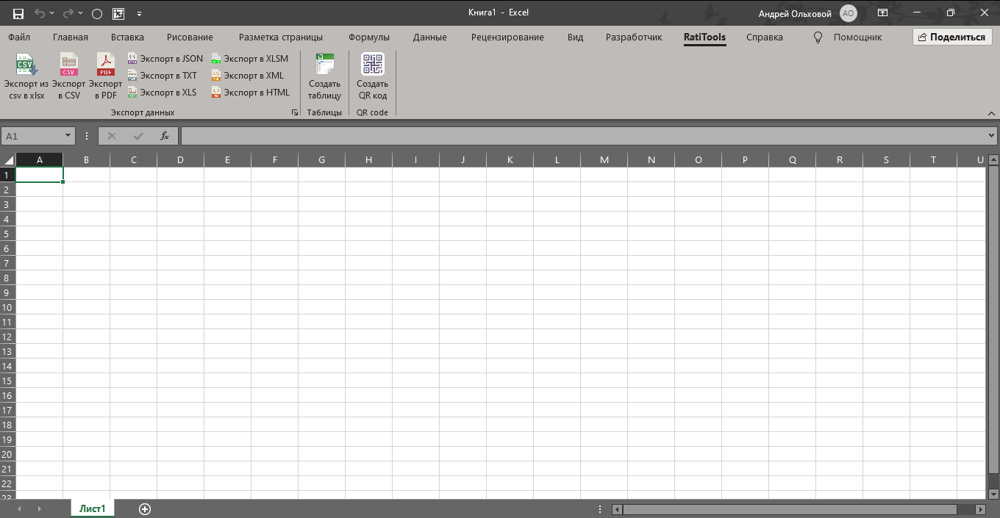

# ExcelAddInЭкспортДанных

Надстройка для Microsoft Excel, предоставляющая расширенные возможности экспорта данных в различные форматы.

## Описание

ExcelAddInЭкспортДанных — это VSTO (Visual Studio Tools for Office) надстройка для Excel, которая расширяет стандартные возможности экспорта данных. Надстройка позволяет экспортировать данные из Excel в различные форматы файлов, а также предоставляет дополнительные инструменты для работы с данными.



> **Примечание:** Замените `Картинки/Картинка1.png` на путь к вашему изображению. Рекомендуется создать папку `images` в корне проекта для хранения скриншотов.

## Основные возможности

### Экспорт данных

- **CSV** — экспорт в формат CSV с настраиваемым разделителем и кодировкой
- **PDF** — экспорт листов и диапазонов в PDF
- **TXT** — экспорт в текстовый формат
- **JSON** — экспорт данных в формат JSON
- **XML** — экспорт в XML формат
- **HTML** — экспорт в HTML
- **XLS/XLSM** — экспорт в старые форматы Excel

### Дополнительные функции

- Импорт CSV в XLSX
- Работа с JSON структурами таблиц
- Создание таблиц в Excel программно
- SQL-запросы к данным Excel

### Генерация QR-кодов

Надстройка предоставляет функционал для создания QR-кодов непосредственно в Excel:

#### Основные возможности:

- **Генерация из текста** — создание QR-кода на основе произвольного текста
- **Массовая генерация** — создание множества QR-кодов из списка значений
- **Генерация из JSON** — автоматическое создание QR-кодов на основе данных таблиц в формате JSON
- **Вставка в ячейки** — автоматическая вставка QR-кодов в указанные ячейки Excel

#### Настройки QR-кодов:

- **Цвета** — настраиваемый цвет QR-кода и фона
- **Размер** — регулируемый размер QR-кода (от 100 до 500 пикселей)
- **Текст под кодом** — опциональное добавление исходного текста под QR-кодом
- **Сохранение в файл** — возможность сохранить QR-коды как PNG изображения в указанную папку
- **Поддержка UTF-8** — корректная обработка кириллицы и других Unicode символов

#### Использование:

1. Откройте панель "Создать QR-код" через вкладку "RatiTools" на ленте Excel
2. Выберите режим генерации (один QR-код или несколько)
3. Введите данные или выберите таблицу для JSON-формата
4. Настройте параметры (цвета, размер, добавление текста)
5. Выберите место вставки или сохранения QR-кодов
6. Создайте QR-коды

QR-коды можно копировать в буфер обмена через контекстное меню для дальнейшего использования в других приложениях.

## Требования

- Microsoft Excel 2010 или выше
- .NET Framework 4.8
- Visual Studio Tools for Office Runtime (VSTO Runtime 4.0)

## Технологии

- **.NET Framework 4.8**
- **VSTO (Visual Studio Tools for Office)**
- **EPPlus 7.4.1** — для работы с Excel файлами
- **Newtonsoft.Json 13.0.3** — для работы с JSON
- **ZXing.Net 0.16.9** — для генерации QR-кодов

## Структура проекта

```
ExcelAddInЭкспортДанных/
├── classes/                  # Основные классы функциональности
│   ├── CommonMethods.cs      # Общие вспомогательные методы
│   ├── ExportData.cs         # Класс для экспорта данных
│   ├── QRcode.cs             # Генерация QR-кодов
│   ├── RequestGeneration.cs  # SQL-запросы к данным
│   ├── WorkingJSON.cs        # Работа с JSON
│   └── WorkingWithTables.cs  # Работа с таблицами Excel
├── forms/                    # Формы пользовательского интерфейса
│   ├── ExportCsvToXlsx.cs    # Импорт CSV в XLSX
│   ├── ExportXlsxToCsv.cs    # Экспорт XLSX в CSV
│   ├── ExportXlsxToDF.cs     # Экспорт в различные форматы
│   └── FormDialogTableStructureJASON_Sample.cs
├── UserControl/              # Пользовательские элементы управления
│   ├── QRControl.cs          # Элемент управления для QR-кодов
│   └── TableСreationForm.cs  # Форма создания таблиц
├── Resources/                # Ресурсы (иконки и изображения)
├── Ribbon.xml                # Определение ленты Excel
├── MyCustomRibbonExportFeed.cs  # Обработчики событий ленты
└── ThisAddIn.cs              # Точка входа надстройки
```

## Установка

1. Клонируйте репозиторий:
```bash
git clone <repository-url>
```

2. Откройте решение `ExcelAddInЭкспортДанных.sln` в Visual Studio

3. Восстановите NuGet пакеты:
```bash
nuget restore
```

4. Соберите проект в режиме Release или Debug

5. Установите надстройку:
   - Для разработки: запустите проект из Visual Studio (F5)
   - Для распространения: используйте созданный установщик или скопируйте собранные файлы в папку надстроек Excel

## Использование

После установки надстройки в Excel появится новая вкладка **"RatiTools"** на ленте с группой **"Экспорт данных"**.

### Основные операции

1. **Экспорт в CSV**: Нажмите кнопку "Экспорт в CSV" для экспорта активного листа или всей книги
2. **Экспорт в PDF**: Используйте кнопку "Экспорт в PDF" для создания PDF файлов
3. **Экспорт в TXT**: Кнопка "Экспорт в TXT" для текстового экспорта
4. **Другие форматы**: Используйте диалоговое окно для доступа к дополнительным форматам (JSON, XML, HTML и др.)
5. **Создание QR-кодов**: Откройте панель "Создать QR-код" для генерации QR-кодов из текста или данных таблиц

### Настройки экспорта

- Выбор кодировки (UTF-8, Windows-1251 и др.)
- Настройка разделителей для CSV
- Выбор диапазона данных (активный лист, выделенный диапазон, вся книга)
- Автоматическое открытие файлов после экспорта

## Разработка

### Сборка проекта

```bash
msbuild ExcelAddInЭкспортДанных.sln /p:Configuration=Release
```

### Отладка

1. Установите точку останова в коде
2. Нажмите F5 в Visual Studio
3. Excel откроется с загруженной надстройкой
4. Выполните действия для вызова отлаживаемого кода

## Зависимости

Основные зависимости указаны в `packages.config`:

- EPPlus (7.4.1)
- EPPlus.Interfaces (6.1.1)
- EPPlus.System.Drawing (6.1.1)
- Newtonsoft.Json (13.0.3)
- ZXing.Net (0.16.9)
- Microsoft.IO.RecyclableMemoryStream (3.0.1)

## Лицензия

[Указать лицензию, если применимо]

## Авторы

Ольховой Андрей

## Поддержка

[Указать контакты для поддержки или ссылки ]
